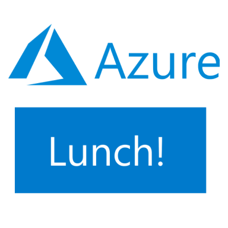
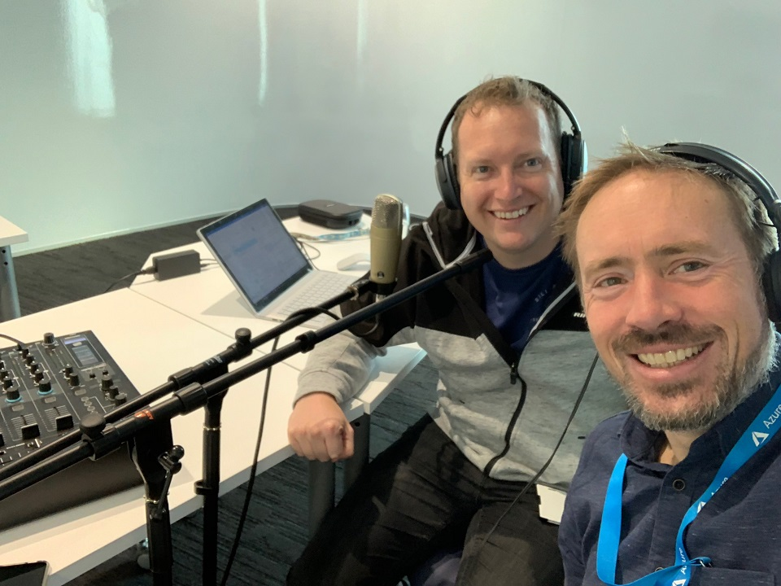

# Azure Lunch!

 

* [Subscribe on Apple Podcasts](https://podcasts.apple.com/nz/podcast/azure-lunch/id1436427476)
* [Subscribe on Android](https://subscribeonandroid.com/azurelunchnz.azureedge.net/podcast/feed.rss)
* [Blubrry](https://www.blubrry.com/azure_lunch/)
* [Stitcher](https://www.stitcher.com/podcast/azure-lunch)

Azure Lunch is a regular podcast of news and views from Microsoft Azure with a Kiwi slant. Presented
by <a href="https://twitter.com/DanielLarsenNZ"> Daniel Larsen</a> and <a href="https://twitter.com/msimpsonnz">Matt Simpson</a>
with special guests.
 

Sponsored by the <a href="https://aka.ms/nzpartnerhub">Microsoft NZ Partner Hub</a>.
If you're building software or providing services related to Microsoft products then you should check
out the Partner hub for training, advice and a heap of resources including the Partner Practice 
Playbooks - <a href="https://aka.ms/nzpartnerhub">https://aka.ms/nzpartnerhub</a>

Thanks to <a href="https://silverwhk.bandcamp.com/">SilverWHK</a> for the use of his music in our podcast: <a href="https://silverwhk.bandcamp.com/">https://silverwhk.bandcamp.com</a>

Daniel Larsen and Matt Simpson are employees of Microsoft. The opinions expressed in this podcast are
their own and not an official company statement.

Read the show notes in [/podcasts](/podcasts)
