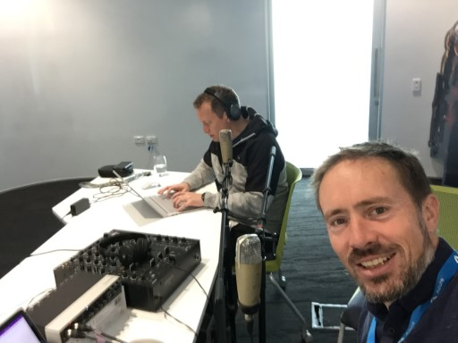

# Azure Lunch!

## S1E04: Azure Governance, a developer's journey

In this episode <a href="https://twitter.com/msimpsonnz">Matt Simpson</a> talks to 
<a href="https://twitter.com/DanielLarsenNZ">Daniel Larsen</a>, Senior Technical Evangelist at
Microsoft, about his recent <a href="https://www.meetup.com/Auckland-Azure-Lunchtime-Meetup/events/253772141/">Operating
Azure at Scale</a> talk at the Auckland Azure Lunchtime meetup. How did a software developer become so 
passionate about governance? What has been the evolution of Azure Governance from a field engineer's
perspective? And how do the new Azure Blueprints and Policy features apply to PaaS workloads?

Show links:

<ul>
<li><a href="https://aka.ms/nzpartnerhub">Microsoft NZ Partner Hub</a></li>
<li><a href="https://partner.microsoft.com/en-nz/campaigns/cloud-practice-playbooks">Cloud practice playbooks</a></li>
<li><a href="https://www.meetup.com/Auckland-Azure-Lunchtime-Meetup/events/253772141/">Operating Azure at Scale (meetup page)</a></li>
<li><a href="https://www.blubrry.com/azure_lunch/38894513/meetup-azure-governance-operating-azure-at-scale/">Operating Azure at Scale - video</a></li>
<li><a href="https://github.com/DanielLarsenNZ/talks/tree/master/azure-governance-2018">Operating Azure at Scale - slides and notes</a></li>
<li><a href="https://myignite.techcommunity.microsoft.com/sessions/65631">Deep dive into Implementing governance at scale through Azure Policy (Ignite 2018)</a></li>
</ul>

Azure Lunch is a regular podcast of news and views from Microsoft Azure with a Kiwi slant. Today's episode
is sponsored by the Microsoft NZ Partner Hub. If you're building software or providing services related
to Microsoft products then you should check out the Partner hub for training, advice and a heap of resources
including the Partner Practice Playbooks - <a href="https://aka.ms/nzpartnerhub">https://aka.ms/nzpartnerhub</a>

Thanks to SilverWHK for the use of his music in our podcast: <a href="https://silverwhk.bandcamp.com/">https://silverwhk.bandcamp.com</a>

Daniel Larsen and Matt Simpson are employees of Microsoft. The opinions expressed in this podcast are
their own and not an official company statement.

