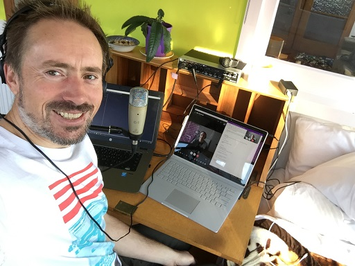

# Azure Lunch!

## Ben Chartrand from Timely on Azure Functions, Cloudflare Workers and Cloud architecture patterns

> S1E05: [Play the episode now](https://azurelunchnz.azureedge.net/podcasts/azure-lunch-s1e05.mp3) |
> [Subscribe on Apple Podcasts](https://itunes.apple.com/nz/podcast/azure-lunch/id1436427476?mt=2)
| [Subscribe on Android](https://subscribeonandroid.com/azurelunchnz.azureedge.net/podcast/feed.rss)

In this episode <a href="https://twitter.com/DanielLarsenNZ">Daniel Larsen</a>, Senior Technical Evangelist at
Microsoft, talks to <a href="https://twitter.com/bcnzer">Ben Chartrand</a> a Platform Development lead
at Timely about Azure Functions v2, Cloudflare Workers and his favourite Cloud architecture patterns
for economy and scale.

Show links:

<ul>
<li><a href="https://aka.ms/nzpartnerhub">Microsoft NZ Partner Hub</a></li>
<li><a href="https://partner.microsoft.com/en-nz/campaigns/cloud-practice-playbooks">Download the Cloud Practice Playbooks</a></li>
<li><a href="https://docs.microsoft.com/en-us/azure/azure-functions/functions-overview">Azure Functions</a></li>
<li><a href="https://www.cloudflare.com/products/cloudflare-workers/">Cloudflare workers</a></li>
<li><a href="https://azure.microsoft.com/en-us/campaigns/cloud-application-architecture-guide/">Download the Cloud Application Architecture Guide</a></li>
</ul>

Azure Lunch is a regular podcast of news and views from Microsoft Azure with a Kiwi slant. This episode
is sponsored by the Microsoft NZ Partner Hub. If you're building software or providing services related
to Microsoft products then you should check out the Partner hub for training, advice and a heap of resources
including the Partner Practice Playbooks - <a href="https://aka.ms/nzpartnerhub">https://aka.ms/nzpartnerhub</a>

Thanks to SilverWHK for the use of his music in our podcast: <a href="https://silverwhk.bandcamp.com/">https://silverwhk.bandcamp.com</a>

Daniel Larsen is an employee of Microsoft. The opinions expressed in this podcast are
his own and not an official company statement.

