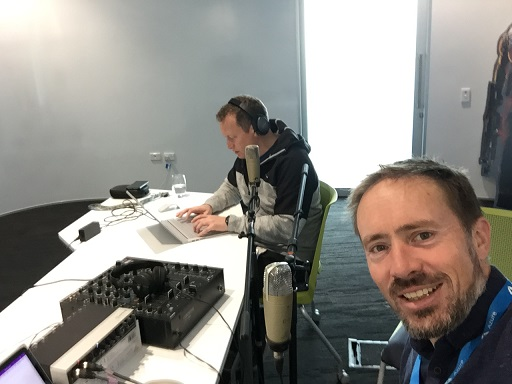

# Azure Lunch!

## Azure lunch - .NET Application Architecture

> S1E06: [Play the episode now](https://azurelunch.azurefd.net/episodes/azure-lunch-s1e06.mp3) |
> [Subscribe on Apple Podcasts](https://podcasts.apple.com/nz/podcast/azure-lunch/id1436427476)
| [Subscribe on Android](https://subscribeonandroid.com/azurelunchnz.azureedge.net/podcast/feed.rss)

In this episode <a href="https://twitter.com/msimpsonnz">Matt Simpson</a> and <a 
href="https://twitter.com/DanielLarsenNZ">Daniel Larsen</a>, Senior Technical Evangelists at
Microsoft, are reunited to quickly cover what has been keeping them busy lately, including .NET Core,
.NET Application Architecture, the Visual Studio 15.9 release, Web Assembly, Blazor and more!

Show links:

<ul>
<li><a href="https://aka.ms/nzpartnerhub">Microsoft NZ Partner Hub</a></li>
<li><a href="https://partner.microsoft.com/en-nz/campaigns/cloud-practice-playbooks">Cloud practice playbooks</a></li>
<li><a href="https://www.meetup.com/Auckland-Azure-Lunchtime-Meetup/">Azure Lunchtime Meetup</a></li>
<li><a href="https://github.com/dotnet-architecture">.NET Application Architecture - Reference Apps (including eShop on Containers)</a></li>
<li><a href="https://www.safaribooksonline.com/library/view/the-art-of/9781617290893/">The Art of Unit Testing by Roy Osherove</a></li>
<li><a href="https://dev.botframework.com/">Microsoft Bot Framework</a></li>
<li><a href="https://docs.microsoft.com/en-nz/visualstudio/releasenotes/vs2017-relnotes">Visual Studio 2017 version 15.9 Release Notes</a></li>
</ul>

Azure Lunch is a regular podcast of news and views from Microsoft Azure with a Kiwi slant. Today's episode
is sponsored by the Microsoft NZ Partner Hub. If you're building software or providing services related
to Microsoft products then you should check out the Partner hub for training, advice and a heap of resources
including the Partner Practice Playbooks - <a href="https://aka.ms/nzpartnerhub">https://aka.ms/nzpartnerhub</a>

Thanks to SilverWHK for the use of his music in our podcast: <a href="https://silverwhk.bandcamp.com/">https://silverwhk.bandcamp.com</a>

Daniel Larsen and Matt Simpson are employees of Microsoft. The opinions expressed in this podcast are
their own and not an official company statement.

