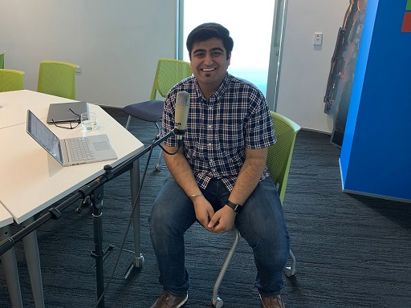

# Azure Lunch!

## The evolution of Conversational AI with Vishesh Oberoi

> S1E07: [Play the episode now](https://azurelunchnz.azureedge.net/podcasts/azure-lunch-s1e07.mp3) |
> [Subscribe on Apple Podcasts](https://itunes.apple.com/nz/podcast/azure-lunch/id1436427476?mt=2)
| [Subscribe on Android](https://subscribeonandroid.com/azurelunchnz.azureedge.net/podcast/feed.rss)

In this episode <a href="https://twitter.com/msimpsonnz">Matt Simpson</a> and <a 
href="https://twitter.com/DanielLarsenNZ">Daniel Larsen</a>, Senior Technical Evangelists at
Microsoft, talk to <a href="https://twitter.com/ovishesh">Vishesh Oberoi</a>, Program Manager at Microsoft,
about the evolution of Conversational AI, developing Chat bots, some of the considerations when 
designing an SDK and much more!

> Apologies for the occassional glitches in this recording 😕

Show links:

<ul>
<li><a href="https://aka.ms/nzpartnerhub">Microsoft NZ Partner Hub</a></li>
<li><a href="https://partner.microsoft.com/en-nz/campaigns/cloud-practice-playbooks">Cloud practice playbooks</a></li>
<li><a href="https://www.meetup.com/Auckland-Azure-Lunchtime-Meetup/">Azure Lunchtime Meetup</a></li>
<li><a href="https://dev.botframework.com/">Microsoft Bot Framework</a></li>
<li><a href="https://github.com/Microsoft/BotBuilder">Bot Builder SDK</a></li>
<li><a href="https://github.com/Microsoft/BotBuilder-Samples/tree/master/samples/csharp_dotnetcore/18.bot-authentication">Bot 
    authentication sample (C#)</a></li>
</ul>

Azure Lunch is a regular podcast of news and views from Microsoft Azure with a Kiwi slant. Today's episode
is sponsored by the Microsoft NZ Partner Hub. If you're building software or providing services related
to Microsoft products then you should check out the Partner hub for training, advice and a heap of resources
including the Partner Practice Playbooks - <a href="https://aka.ms/nzpartnerhub">https://aka.ms/nzpartnerhub</a>

Thanks to SilverWHK for the use of his music in our podcast: <a href="https://silverwhk.bandcamp.com/">https://silverwhk.bandcamp.com</a>

Daniel Larsen, Matt Simpson and Vishesh Oberoi are employees of Microsoft. The opinions expressed in this podcast are
their own and not an official company statement.

