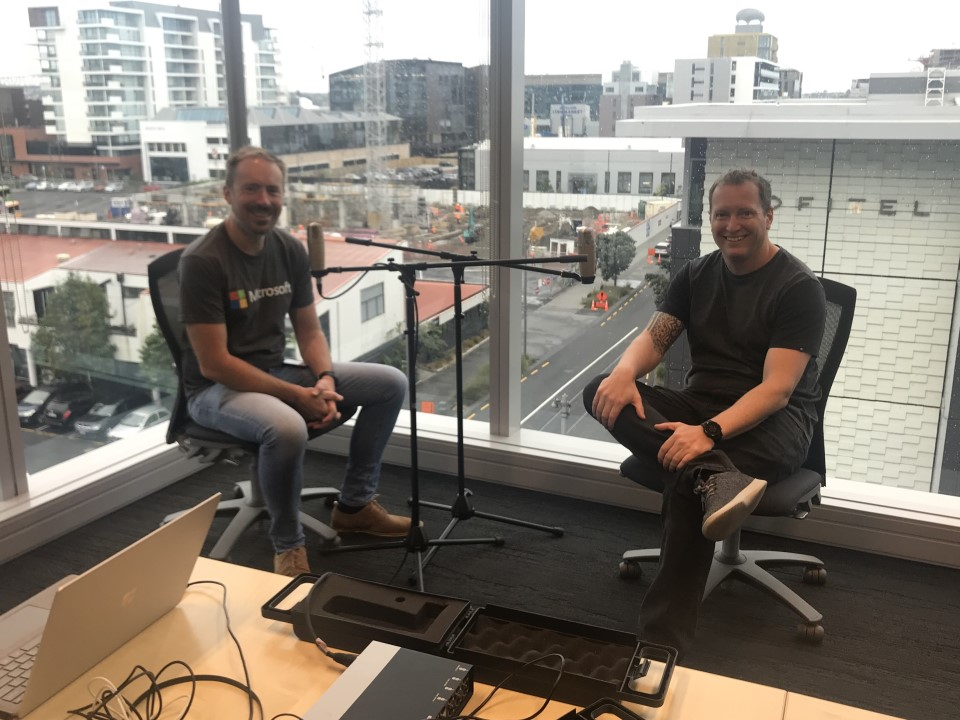

# Azure Lunch!

 _Photo credit: Thanks Phil Goldie!_

## Azure Lunch - We're back!

> S2E09: [Play the episode now](https://azurelunchnz.azureedge.net/podcasts/azure-lunch-s2e01.mp3) |
> [Subscribe on Apple Podcasts](https://itunes.apple.com/nz/podcast/azure-lunch/id1436427476?mt=2)
| [Subscribe on Android](https://subscribeonandroid.com/azurelunchnz.azureedge.net/podcast/feed.rss)

We kick off the 2019 season with a quick review of what we have been up to over the
(NZ) summer break, what is top of mind for Microsoft NZ technical people right now, and what
we have planned for this Season 2 of Azure Lunch!

Show links:

<ul>
<li><a href="https://aka.ms/architecture">Azure Architecture Centre</a></li>
<li><a href="https://aka.ms/nzpartnerhub">Microsoft NZ Partner Hub</a></li>
<li><a href="https://www.meetup.com/Auckland-Azure-Lunchtime-Meetup/">Azure Lunchtime Meetup</a></li>
<li><a href="https://docs.microsoft.com/en-us/learn/">Microsoft Learn</a></li>
</ul>

Azure Lunch is a regular podcast of news and views from Microsoft Azure with a Kiwi slant. This episode
is sponsored by the Azure Architecture Center. For the best advice on Architecture styles, Technology
choices and Design principles for the cloud, including the five pillars of Software quality, checkout
the Azure Application Architecture Guide at <a href="aka.ms/architecture">aka.ms/architecture</a>.

Thanks to SilverWHK for the use of his music in our podcast: <a href="https://silverwhk.bandcamp.com/">https://silverwhk.bandcamp.com</a>

Daniel Larsen and Matt Simpson are employees of Microsoft. The opinions expressed in this podcast are
their own and not an official company statement.

