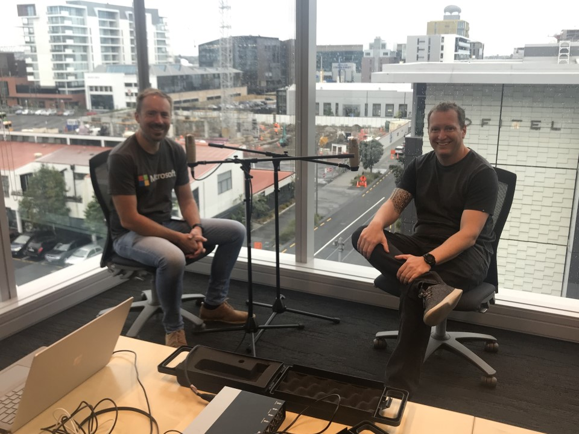

# Azure Lunch!

 _Photo credit: Thanks Phil Goldie!_

## Serverless, but with Servers

> S2E02: [Play the episode now](https://azurelunch.azurefd.net/episodes/azure-lunch-s2e02.mp3) |
> [Subscribe on Apple Podcasts](https://podcasts.apple.com/nz/podcast/azure-lunch/id1436427476)
| [Subscribe on Android](https://subscribeonandroid.com/azurelunchnz.azureedge.net/podcast/feed.rss)

In this episode Dan picks Matt's brain on "Serverless" and what is in a name - what does Serverless
really mean? And where are all the servers? In this wide-ranging talk we discuss which workloads suit
Serverless technologies, common programming languages and frameworks including the new Azure Functions
Runtime 2.0, and the radidly expanding range of services that fall into the serverless category: Azure
Functions, Open FaaS (Functions as a Service), Serverless Databases (!) and global platform services
that present as "serverless" including Cosmos DB, Azure Event Grid, Event Hubs and more!

Show links:

<ul>
<li><a href="https://aka.ms/architecture">Azure Architecture Centre</a></li>
<li><a href="https://docs.microsoft.com/en-us/learn/paths/create-serverless-applications/">Create serverless 
applications</a> (learning path) on Microsoft/Learn</li>
<li><a href="https://docs.microsoft.com/en-us/azure/azure-functions/functions-overview">An introduction to Azure Functions</a></li>
<li><a href="https://docs.microsoft.com/en-us/azure/azure-functions/durable/durable-functions-overview">What are Durable Functions?</a></li>
<li><a href="https://www.troyhunt.com/serverless-to-the-max-doing-big-things-for-small-dollars-with-cloudflare-workers-and-azure-functions/">Serverless 
to the Max: Doing Big Things for Small Dollars with Cloudflare Workers and Azure Functions</a> (TroyHunt.com)</li>
<li><a href="https://docs.microsoft.com/en-us/azure/cosmos-db/introduction">Azure Cosmos DB</a></li>
<li><a href="https://www.meetup.com/Auckland-Azure-Lunchtime-Meetup/">Azure Lunchtime Meetup</a></li>
<li><a href="https://aka.ms/nzpartnerhub">Microsoft NZ Partner Hub</a></li>
</ul>

Azure Lunch is a regular podcast of news and views from Microsoft Azure with a Kiwi slant. This episode
is sponsored by the Azure Architecture Center. For the best advice on Architecture styles, Technology
choices and Design principles for the cloud, including the five pillars of Software quality, checkout
the Azure Application Architecture Guide at <a href="aka.ms/architecture">aka.ms/architecture</a>.

Thanks to SilverWHK for the use of his music in our podcast: <a href="https://silverwhk.bandcamp.com/">https://silverwhk.bandcamp.com</a>

Daniel Larsen and Matt Simpson are employees of Microsoft. The opinions expressed in this podcast are
their own and not an official company statement.

