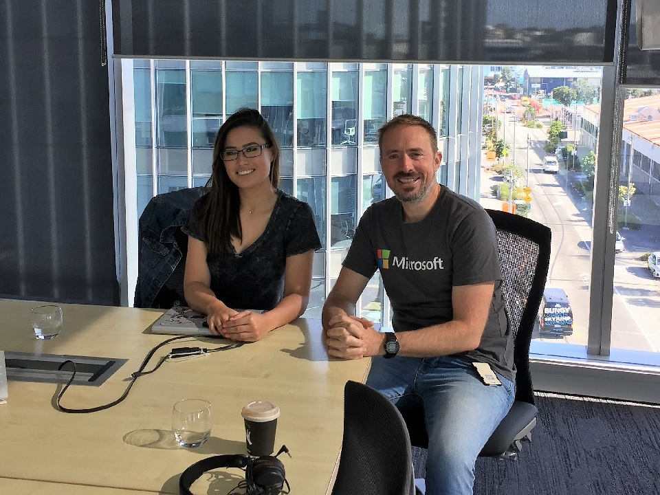

# Azure Lunch!

## Enough Data Science to be Dangerous

> S2E03: [Play the episode now](https://azurelunch.azurefd.net/episodes/azure-lunch-s2e03.mp3) |
> [Subscribe on Apple Podcasts](https://itunes.apple.com/nz/podcast/azure-lunch/id1436427476?mt=2)
| [Subscribe on Android](https://subscribeonandroid.com/azurelunchnz.azureedge.net/podcast/feed.rss)

In this episode I have the good fortune to spend some time with Chimène Bonhomme - A Data Scientist 
and Technical Solutions Professional at Microsoft New Zealand. Chimène lists a Masters of Information 
Technology, Business Intelligence and Data Science, as well as a Bachelor of Health Science, Medical 
and Molecular Biosciences as two of her many amazing achievements. In this episode I ask Chimène for 
her perspective on Data Science, Machine Learning and Artificial Intelligence, asking the question: 
How much data science is enough to be dangerous?

Show links:

<ul>
<li><a href="https://studio.azureml.net/">Microsoft Azure Machine Learning Studio</a></li>
<li><a href="https://aischool.microsoft.com/en-us/home">Microsoft AI School</a></li>
<li><a href="https://azure.microsoft.com/en-us/services/virtual-machines/data-science-virtual-machines/">Data Science Virtual Machines on Microsoft Azure</a></li>
<li><a href="https://www.oreilly.com/library/view/deep-learning-with/9781617294433/">Deep Learning with Python by François Chollet (O'Reilly)</a></li>
<li><a href="https://www.microsoft.com/en-us/ai/ai-for-good">AI for Good with Microsoft Artificial Intelligence</a></li>
<li><a href="https://www.microsoft.com/en-us/ai/seeing-ai">Seeing AI - Talking camera app for those with visual impairment</a></li>
<li><a href="https://www.microsoft.com/en-us/research/product/soundscape/">Microsoft Soundscape - A map delivered in 3D sound</a></li>
<li><a href="https://en.wikipedia.org/wiki/Turing_test">Turing test (Wikipedia)</a></li>
<li><a href="https://en.wikipedia.org/wiki/With_great_power_comes_great_responsibility">With great power comes great responsibility (Wikipedia)</a></li>
<li><a href="https://azure.com/FastTrack">Microsoft Fast Track for Azure</a></li>
</ul>

From Microsoft New Zealand, this is Azure Lunch. A podcast about Microsoft
Azure in short digestible chunks, where we discuss cloud computing from a Kiwi perspective with Architects, 
Engineers and Technical specialists from around the world.

Azure Lunch is sponsored by <a href="https://azure.com/FastTrack">Microsoft Fast Track for Azure</a> - a 
team of Engineers and Program Managers dedicated to helping you to be successful in Azure. Learn more
at <a href="https://azure.com/FastTrack">Azure.com/FastTrack</a>.

Thanks to SilverWHK for the use of his music in our podcast: <a href="https://silverwhk.bandcamp.com/">https://silverwhk.bandcamp.com</a>

Daniel Larsen and guests are employees of Microsoft. The opinions expressed in this podcast are
their own and not an official company statement.

