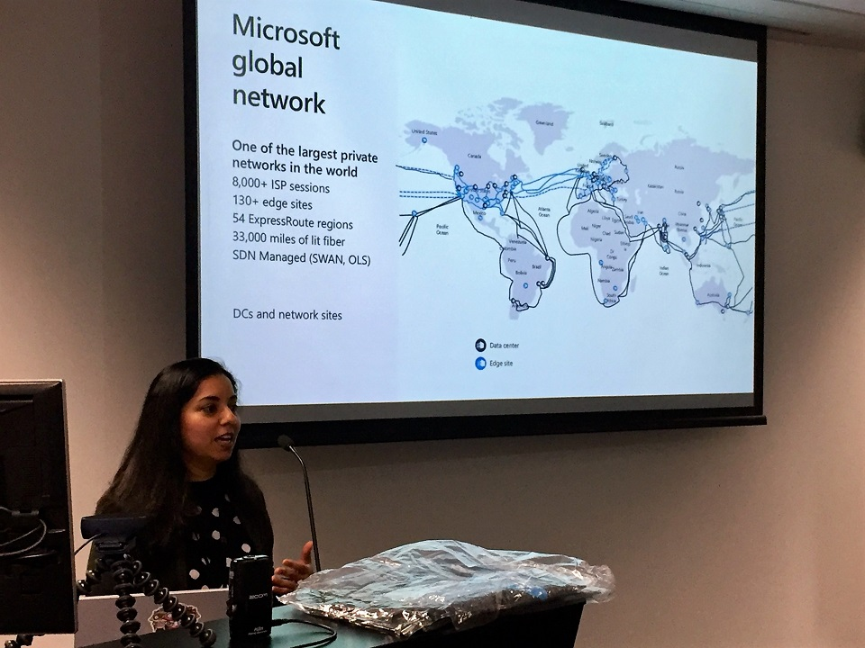

# Azure Lunch!

## Divya Sangar on the new ExpressRoute Edge Node in Auckland

> S2E04: [Play the episode now](https://azurelunch.azurefd.net/episodes/azure-lunch-s2e04.mp3) |
> [Subscribe on Apple Podcasts](https://podcasts.apple.com/nz/podcast/azure-lunch/id1436427476)
| [Subscribe on Android](https://subscribeonandroid.com/azurelunchnz.azureedge.net/podcast/feed.rss)

Divya Sangar started her career in Fiji doing Dialup Internet and PABX installations (when we used
to connect customers by hand, crimping on to the MDFs). Now she works on one of the largest private
owned fibre networks in the world, the Microsoft <a href="https://azure.microsoft.com/en-au/global-infrastructure/global-network/">Azure
Global Network</a>. In this episode Divya takes us on her journey from Network Engineer to Global Networking
Blackbelt, unraveling mysteries along the way of this fascinating area of computing that enables distributed
services to operate at truly global scale.

We also talk about the recently launched ExpressRoute Edge Node in Auckland, which allows 
New Zealand customers to connect locally to the global Azure network, reducing the costs of internetworking
with our Australian Azure Regions and the world. The ExpressRoute Edge Node in Auckland is a first for
New Zealand, unlocking new Network Services including Azure Front Door, ExpressRoute Global Reach and
Virtual WAN.

Show links:

<ul>
<li><a href="https://azure.microsoft.com/en-au/services/expressroute/">Azure ExpressRoute</a></li>
<li><a href="https://www.youtube.com/watch?v=RpuIg2KlaRo">Divya speaking at the Auckland Azure User Group
about the new ExpressRoute Edge Node in Auckland</a></li>
<li><a href="https://www.linkedin.com/pulse/microsoft-brings-predictability-high-bandwidth-slas-hybrid-quesnel/">Announcing
the new ExpressRoute Edge Node in Auckland, New Zealand</a></li>
<li><a href="https://azure.microsoft.com/en-au/global-infrastructure/global-network/">Azure Global Network</a></li>
<li><a href="https://azure.microsoft.com/en-au/blog/how-microsoft-builds-its-fast-and-reliable-global-network/">How
Microsoft builds its fast and reliable global network</a></li>
<li><a href="https://azure.microsoft.com/en-au/services/frontdoor/">Azure Front Door - Global HTTP Load
balancer and app accelerator</a></li>
<li><a href="https://docs.microsoft.com/en-us/azure/expressroute/expressroute-global-reach">ExpressRoute
Global Reach - Connect on-premises networks to Microsoft Cloud</a></li>
<li><a href="https://azure.microsoft.com/en-au/services/virtual-wan/">Virtual WAN - Simple, unified,
global connectivity and security</a></li>
<li><a href="https://azure.com/FastTrack">Microsoft Fast Track for Azure</a></li>
</ul>

From Microsoft New Zealand, this is Azure Lunch. A podcast about Microsoft Azure in short digestible
chunks, where we discuss cloud computing from a Kiwi perspective with Architects, Engineers and Technical
specialists from around the world.

Azure Lunch is sponsored by <a href="https://azure.com/FastTrack">Microsoft Fast Track for Azure</a> - a 
team of Engineers and Program Managers dedicated to helping you to be successful in Azure. Learn more
at <a href="https://azure.com/FastTrack">Azure.com/FastTrack</a>.

Thanks to SilverWHK for the use of his music in our podcast: <a href="https://silverwhk.bandcamp.com/">https://silverwhk.bandcamp.com</a>

Daniel Larsen and Divya Sangar are employees of Microsoft. The opinions expressed in this podcast are
their own and not an official company statement.

