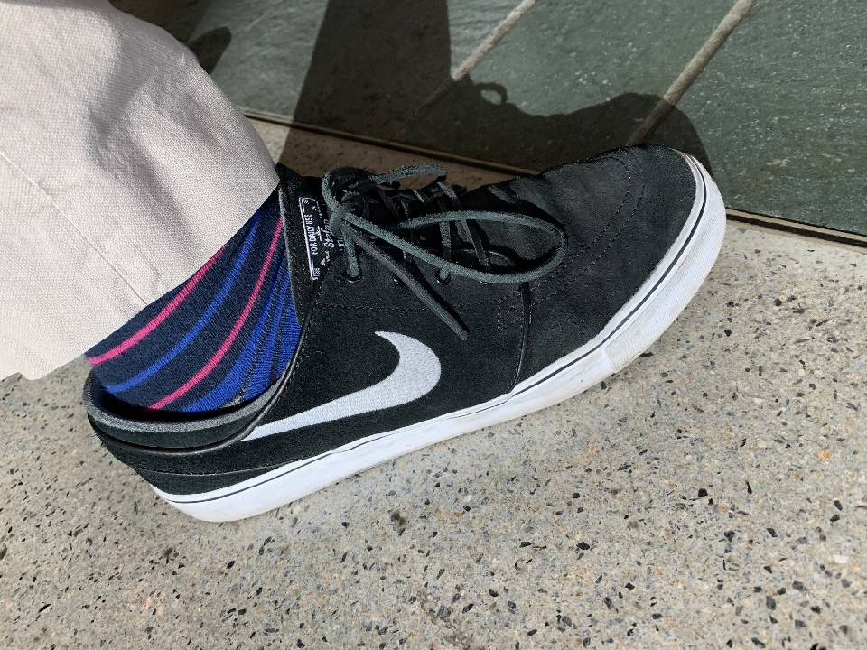

# Azure Lunch!

Photo credit: Dan Rosanova <https://twitter.com/DanRosanova/status/1126141441602756608>

## Dan Rosanova on Messaging in Azure and Craig Loewen on Windows Subsystem for Linux 2 (WSL2)

> S2E05: [Play the episode now](https://azurelunch.azurefd.net/episodes/azure-lunch-s2e05.mp3) |
> [Subscribe on Apple Podcasts](https://podcasts.apple.com/nz/podcast/azure-lunch/id1436427476)
| [Subscribe on Android](https://subscribeonandroid.com/azurelunchnz.azureedge.net/podcast/feed.rss)

At Microsoft //Build 2019 I spent time talking to some of the people who build the products and services
that run on Azure and on Windows. In this Build Special I combine two interviews; the first with Dan
Rosanova, Group Program Manager for Azure Messaging, and the second with Craig Loewen, Program Manager 
for Windows Subsystem for Linux (WSL).

But first let's hear Dan Rosanova talk about two of the amazing messaging services provided by the
Azure Platform: Azure Service Bus and Event Hubs, including recently announced Availability Zone
(AZ) support and Azure Event Hubs for Apache Kafka.

Next we hear from Craig Loewen from the Windows Subsystem for Linux team - yes, you heard right!
For three years now Microsoft have been shipping a Linux Subsystem in Windows 10 which means you can
use many Linux commands at the command line inside Windows. Pretty mind-blowing stuff in 2016! But now
that all seems par for the course as at Microsoft //Build 2019 we announced that, this year, we will
ship a full Linux Kernel in Windows 10 as part of the major improvements in the next version of the
Windows Subsystem for Linux - WSL2. Here's Craig to tell us all about it.

Show links:

<ul>
<li><a href="https://docs.microsoft.com/en-us/azure/service-bus-messaging/service-bus-messaging-overview">What 
is Azure Service Bus?</a></li>
<li><a href="https://docs.microsoft.com/en-in/azure/event-hubs/event-hubs-about">Azure Event Hubs — A 
big data streaming platform and event ingestion service</a></li>
<li><a href="https://docs.microsoft.com/en-us/azure/event-hubs/event-hubs-for-kafka-ecosystem-overview">Use
Azure Event Hubs from Apache Kafka applications</a></li>
<li><a href="https://kafka.apache.org/">Apache Kafka</a></li>
<li><a href="https://azure.microsoft.com/en-in/blog/azure-service-bus-and-azure-event-hubs-expand-availability/">Azure
Service Bus and Azure Event Hubs expand availability</a></li>
<li><a href="https://docs.microsoft.com/en-us/windows/wsl/about">Windows Subsystem for Linux</a></li>
<li><a href="https://devblogs.microsoft.com/commandline/wsl-2-is-now-available-in-windows-insiders/">WSL
2 is now available in Windows Insiders</a></li>
<li><a href="https://azure.com/FastTrack">Microsoft Fast Track for Azure</a></li>
</ul>

From Microsoft New Zealand, this is Azure Lunch. A podcast about Microsoft Azure in short digestible
chunks, where we discuss cloud computing from a Kiwi perspective with Architects, Engineers and Technical
specialists from around the world.

Azure Lunch is sponsored by <a href="https://azure.com/FastTrack">Microsoft Fast Track for Azure</a> 
- a team of Engineers and Program Managers dedicated to helping you to be successful in Azure. Learn 
more at <a href="https://azure.com/FastTrack">Azure.com/FastTrack</a>.

Thanks to SilverWHK for the use of his music in our podcast: <a href="https://silverwhk.bandcamp.com/">https://silverwhk.bandcamp.com</a>

Daniel Larsen and his guests are employees of Microsoft. The opinions expressed in this podcast are
their own and not an official company statement.

