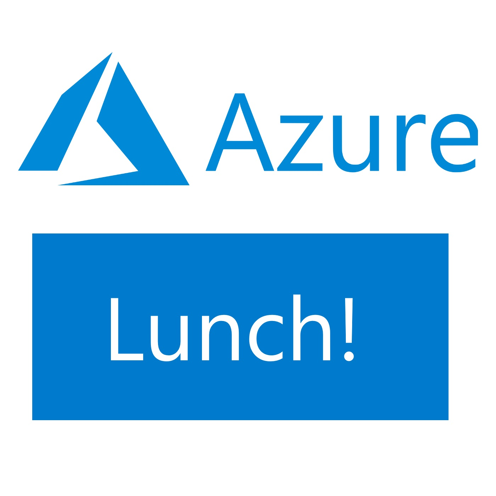

# Azure Lunch!

## Sharad Agrawal on Azure Front Door, a global HTTP load-balancer

> S2E06: [Play the episode now](https://azurelunch.azurefd.net/episodes/azure-lunch-s2e06.mp3) |
> [Subscribe on Apple Podcasts](https://podcasts.apple.com/nz/podcast/azure-lunch/id1436427476)
| [Subscribe on Android](https://subscribeonandroid.com/azurelunchnz.azureedge.net/podcast/feed.rss)

In this fascinating interview, recorded at Microsoft //Build 2019, I talk with <strong>Sharad Agrawal</strong>, 
Program Manager at Microsoft about <strong>Azure Front Door</strong>. This remarkable service fronts
some of the largest web properties on the planet, including Xbox, Bing, Teams, and Azure DevOps, serving <em>millions</em> of requests per <em>second</em>.

Azure Front Door is now generally available to all customers, offering a truly global Layer-7 Load-balancer
with Web Application Firewall, DDOS protection, automatic SSL certificate management and 
much more. Sit back and enjoy as Sharad takes us deep into this service and the Microsoft
global network that powers it.

As always, Sharad and I are employees of Microsoft and our opinions are our own.

Show links:

<ul>
<li><a href="https://docs.microsoft.com/en-us/azure/frontdoor/front-door-overview">What is Azure Front Door Service?</a></li>
<li><a href="https://docs.microsoft.com/en-us/azure/networking/microsoft-global-network">Microsoft global network</a></li>
<li><a href="https://azure.com/FastTrack">Microsoft Fast Track for Azure</a></li>
</ul>

From Microsoft New Zealand, this is Azure Lunch. A podcast about Microsoft Azure in short digestible
chunks, where we discuss cloud computing from a Kiwi perspective with Architects, Engineers and Technical
specialists from around the world.

Azure Lunch is sponsored by <a href="https://azure.com/FastTrack">Microsoft Fast Track for Azure</a> 
- a team of Engineers and Program Managers dedicated to helping you to be successful in Azure. Learn 
more at <a href="https://azure.com/FastTrack">Azure.com/FastTrack</a>.

Thanks to SilverWHK for the use of his music in our podcast: <a href="https://silverwhk.bandcamp.com/">https://silverwhk.bandcamp.com</a>

Daniel Larsen and his guests are employees of Microsoft. The opinions expressed in this podcast are
their own and not an official company statement.

