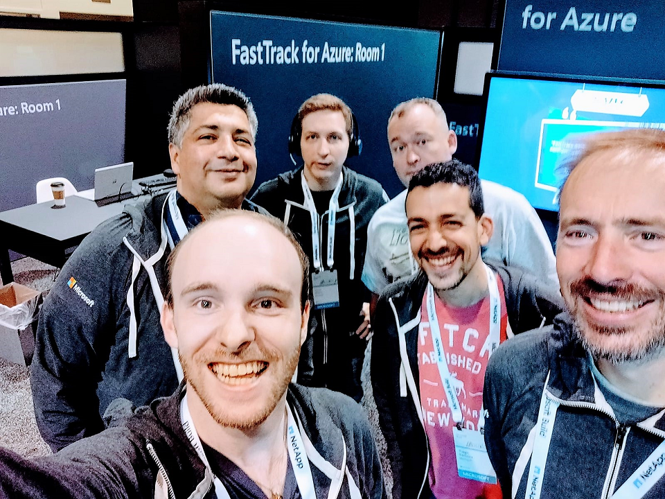

# Azure Lunch!

_Chris, Alex, Chris, John, Tiago and Dan from the FastTrack for Azure team at Microsoft //Build 2019._

## Tiago Barbosa on Azure Kubernetes Service (AKS)

> S2E07: [Play the episode now](https://azurelunch.azurefd.net/episodes/azure-lunch-s2e07.mp3) |
> [Subscribe on Apple Podcasts](https://podcasts.apple.com/nz/podcast/azure-lunch/id1436427476)
| [Subscribe on Android](https://subscribeonandroid.com/azurelunchnz.azureedge.net/podcast/feed.rss)

In this episode of Azure Lunch I chat with Tiago Barbosa, a FastTrack for Azure Engineer based in Portugal,
about his ten-year career at Microsoft from intern to Senior Engineer on the Azure Engineering Team.
As well as several key announcements at the Microsoft //Build 2019 conference for Azure Kubernetes Service 
(AKS) and much more. 

Tiago and I are employees of Microsoft and our opinions are our own.

Show links:

<ul>
<li><a href="https://azure.microsoft.com/en-us/services/kubernetes-service/">Azure Kubernetes Service</a></li>
<li><a href="https://azure.microsoft.com/en-us/blog/announcing-the-preview-of-windows-server-containers-support-in-azure-kubernetes-service/">Announcing 
the preview of Windows Server containers support in Azure Kubernetes Service</a></li>
<li><a href="https://docs.microsoft.com/en-us/azure/aks/use-multiple-node-pools">Create and manage multiple 
node pools in AKS</a></li>
<li><a href="https://www.openshift.com/products/azure-openshift">Microsoft Azure Red Hat OpenShift</a></li>
<li><a href="https://azure.com/FastTrack">Microsoft Fast Track for Azure</a></li>
</ul>

From Microsoft New Zealand, this is Azure Lunch. A podcast about Microsoft Azure in short digestible
chunks, where we discuss cloud computing from a Kiwi perspective with Architects, Engineers and Technical
specialists from around the world.

Azure Lunch is sponsored by <a href="https://azure.com/FastTrack">Microsoft Fast Track for Azure</a> 
- a team of Engineers and Program Managers dedicated to helping you to be successful in Azure. Learn 
more at <a href="https://azure.com/FastTrack">Azure.com/FastTrack</a>.

Thanks to SilverWHK for the use of his music in our podcast: <a href="https://silverwhk.bandcamp.com/">https://silverwhk.bandcamp.com</a>

Daniel Larsen and his guests are employees of Microsoft. The opinions expressed in this podcast are
their own and not an official company statement.

