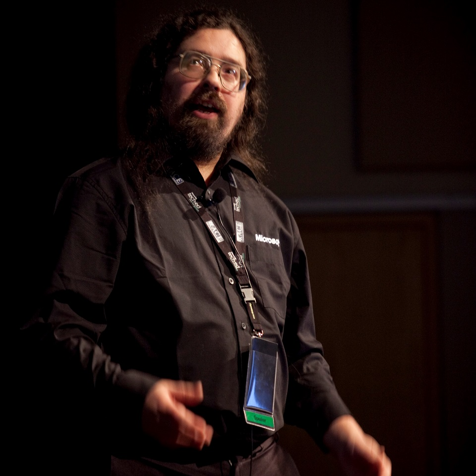

# Azure Lunch!

_Ivan Towlson speaking at Microsoft Ignite 2009 in Auckland, New Zealand. [Photo credit: Microsoft NZ](https://www.flickr.com/photos/techedlive/3924981450/)._

## Ivan Towlson

> S2E08: [Play the episode now](https://azurelunch.azurefd.net/episodes/azure-lunch-s2e08.mp3) |
> [Subscribe on Apple Podcasts](https://podcasts.apple.com/nz/podcast/azure-lunch/id1436427476)
| [Subscribe on Android](https://subscribeonandroid.com/azurelunchnz.azureedge.net/podcast/feed.rss)

Ivan Towlson (<a href="https://twitter.com/ppog_penguin">@ppog_penguin</a>) is a programmer, software architect and speaker. He works for Microsoft on the team
responsible for Cloud-native developer tools including Helm, Draft, Brigade, Duffel, CNAB and VSCode
extensions for Kubernetes. In this interview, recorded in a noisy Hotel lobby during Codemania 2019,
we cover a wide range of topics from distributed data structures to functional languages to the history
of .NET and why Microsoft is investing so heavily in opensource.

Ivan and I are employees of Microsoft and our opinions are our own.

Show links:

<ul>
<li><a href="https://azure.com/FastTrack">Microsoft Fast Track for Azure</a></li>
<li><a href="https://codemania.io/">Codemania. A conference for developers.</a></li>
<li><a href="https://codemania.io/speakers/2019/heather">Heather Miller. What happened to distributed
    programming languages?</a></li>
<li><a href="https://github.com/Azure/vscode-kubernetes-tools">Visual Studio Code Kubernetes Tools</a></li>
<li><a href="https://channel9.msdn.com/Events/TechEd/NewZealand/2013/DEV306">10 F# Features Every C#
    Developer Should Crave (TechEd 2013)</a></li>
<li><a href="https://channel9.msdn.com/Events/TechEd/NewZealand/2011/DEV403">Dynamic and meta-programming
    in .NET 4 (TechEd 2011)</a></li>
<li><a href="https://channel9.msdn.com/Events/TechEd/NewZealand/2013/DEV414">Taming Time: A Deep Dive
    into the Reactive Extensions (TechEd 2013)</a></li>
<li><a href="https://github.com/dotnet/coreclr/pull/23466">dotnet/coreclr issue #23466: Nullable: System.Object</a></li>
<li><a href="https://channel9.msdn.com/Events/Build/2016/B881">What's new in TypeScript? by Anders Hejlsberg
    in 2016</a></li>
<li><a href="https://github.com/microsoft/terminal">Microsoft Terminal - GitHub</a></li>
<li><a href="https://azure.microsoft.com/en-us/services/kubernetes-service/">Azure Kubernetes Service</a></li>
<li><a href="https://azure.com/FastTrack">Microsoft Fast Track for Azure</a></li>
</ul>

From Microsoft New Zealand, this is Azure Lunch. A podcast about Microsoft Azure in short digestible
chunks, where we discuss cloud computing from a Kiwi perspective with Architects, Engineers and Technical
specialists from around the world.

Azure Lunch is sponsored by <a href="https://azure.com/FastTrack">Microsoft Fast Track for Azure</a> 
- a team of Engineers and Program Managers dedicated to helping you to be successful in Azure. Learn 
more at <a href="https://azure.com/FastTrack">Azure.com/FastTrack</a>.

Thanks to SilverWHK for the use of his music in our podcast: <a href="https://silverwhk.bandcamp.com/">https://silverwhk.bandcamp.com</a>

Daniel Larsen and his guests are employees of Microsoft. The opinions expressed in this podcast are
their own and not an official company statement.

